# API Integration Architecture

This document details the API integration patterns and data management strategies used in the RWD Hydrogen application.

## GraphQL Schema Overview

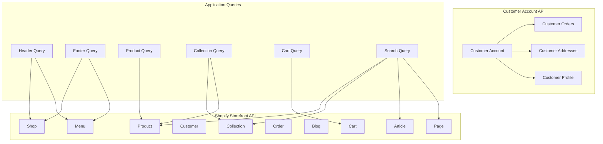

## Data Fetching Patterns

### Critical vs Deferred Data Loading

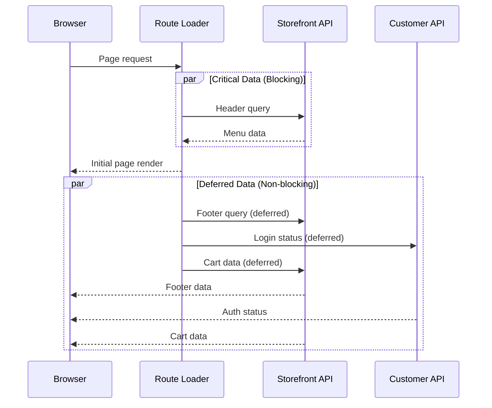

### Caching Strategy

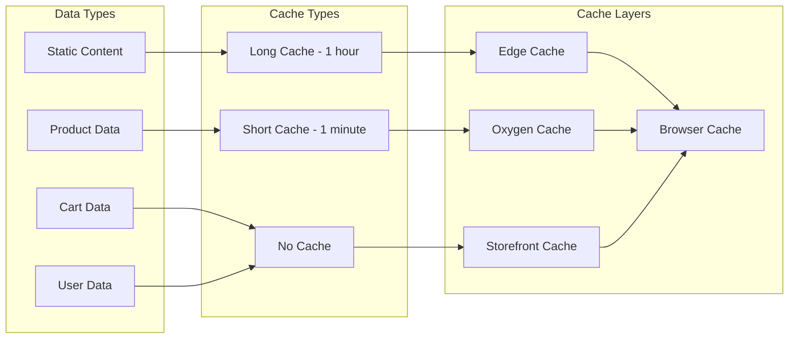

## GraphQL Fragments

### Fragment Organization

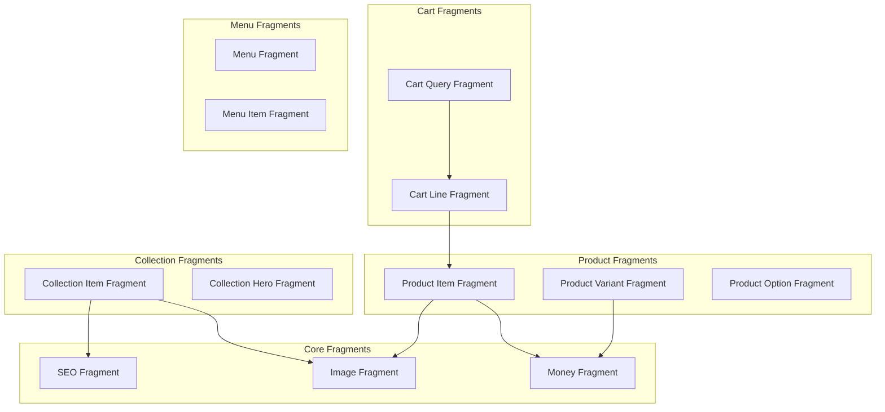

## Context Management

### Hydrogen Context Structure

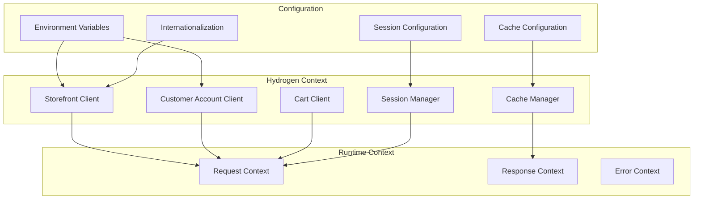

## API Authentication Flow

### Customer Account API Authentication

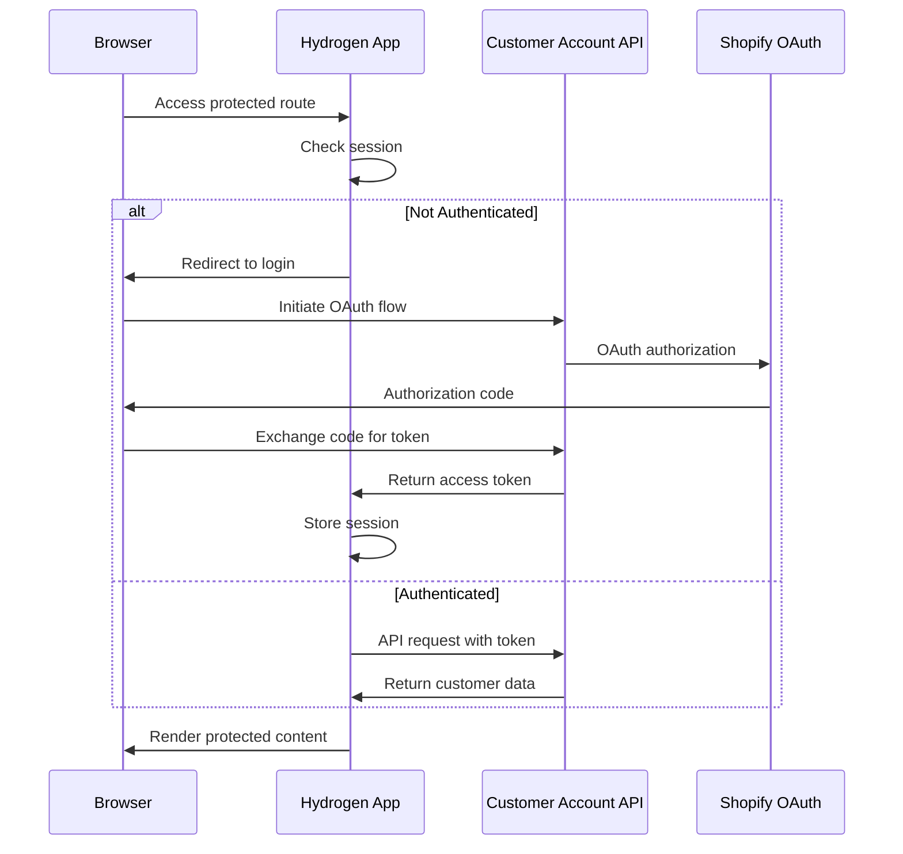

## Error Handling Strategy

### GraphQL Error Management

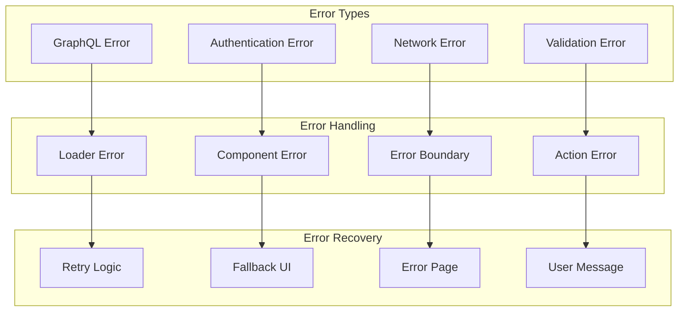

## Performance Optimization

### Query Optimization Strategies

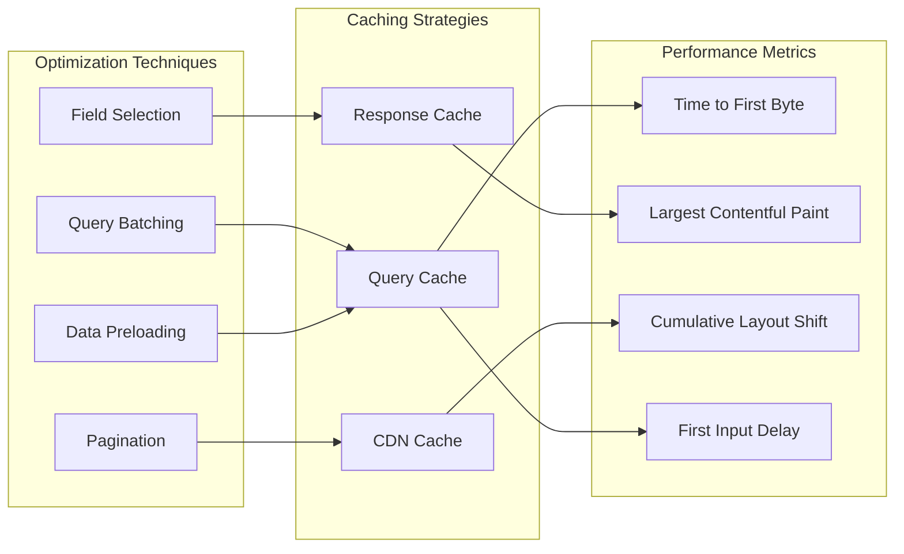

## Data Synchronization

### Real-time Updates

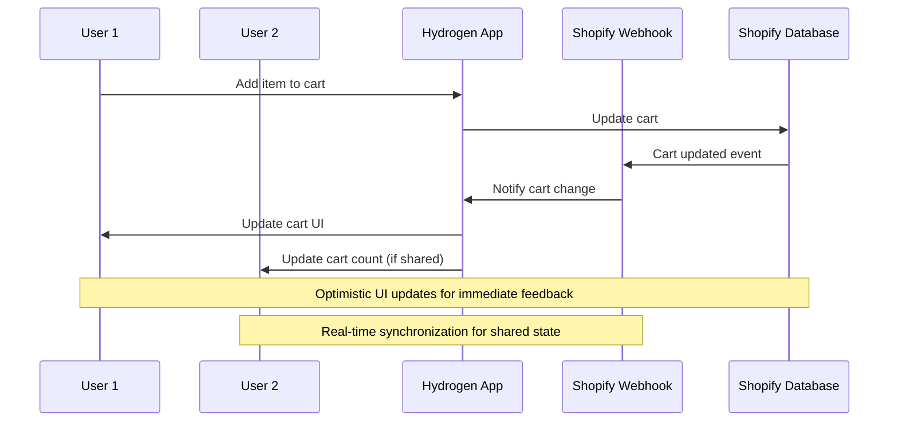

## Type Safety

### Generated Types Flow

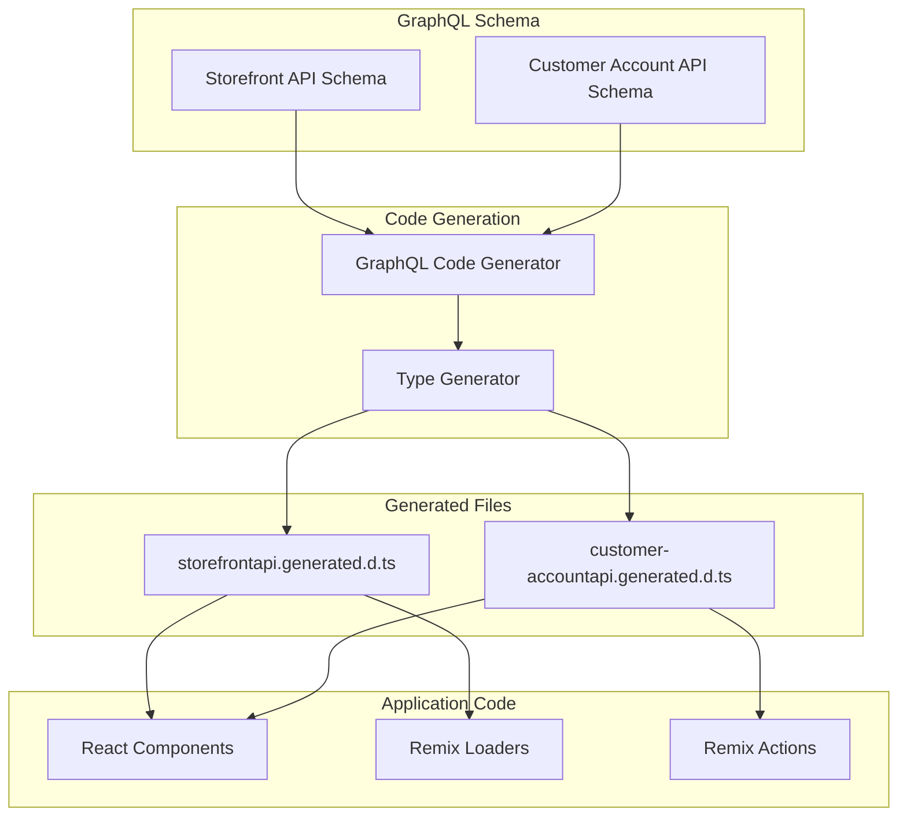

## Security Considerations

### API Security Measures

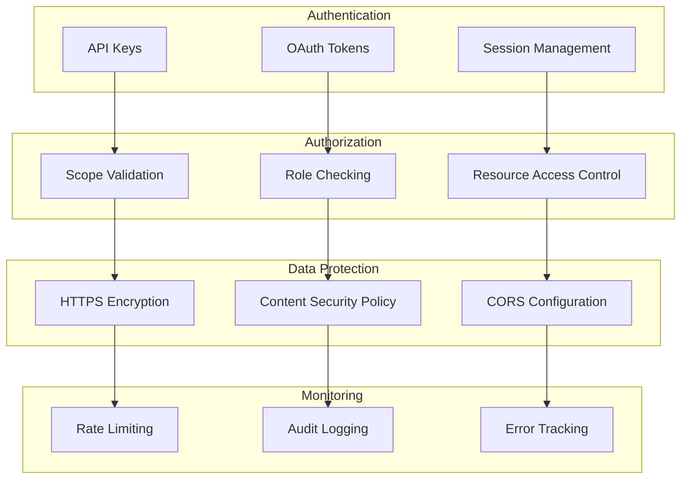

This API integration architecture ensures robust, performant, and secure communication with Shopify's various APIs while maintaining excellent developer experience and user performance.