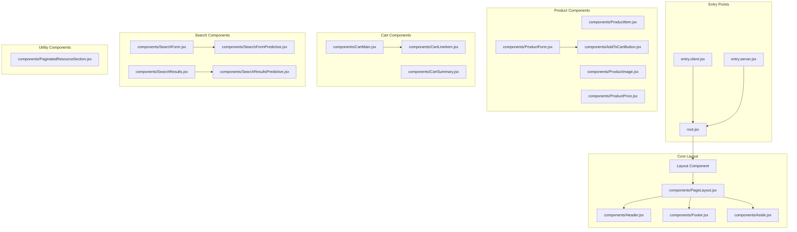
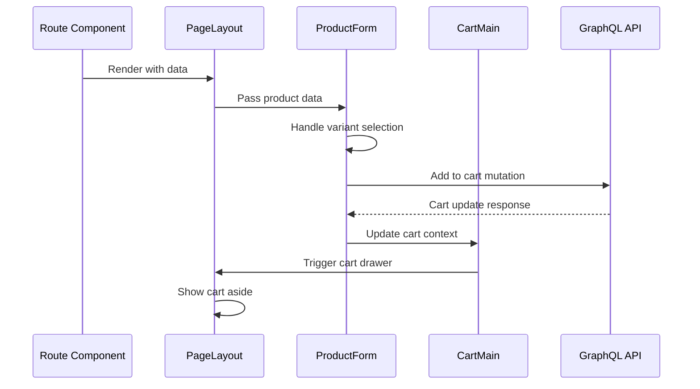

# Component Architecture Guide

This document provides detailed information about the component structure and relationships in the RWD Hydrogen application.

## Component Hierarchy

## Component Responsibilities

### Layout Components

#### PageLayout
- **Purpose**: Main layout wrapper for all pages
- **Responsibilities**:
  - Provides consistent header/footer structure
  - Manages aside panel state
  - Handles cart drawer functionality
  - Provides layout context to child components

#### Header
- **Purpose**: Site navigation and branding
- **Responsibilities**:
  - Site logo and navigation menu
  - User account access
  - Cart summary display
  - Search functionality trigger

#### Footer
- **Purpose**: Site footer with links and information
- **Responsibilities**:
  - Footer navigation menus
  - Legal and policy links
  - Newsletter signup
  - Social media links

#### Aside
- **Purpose**: Sliding panel for cart and mobile menu
- **Responsibilities**:
  - Cart drawer functionality
  - Mobile navigation menu
  - Overlay and close mechanisms

### Product Components

#### ProductItem
- **Purpose**: Product listing item display
- **Responsibilities**:
  - Product image display
  - Product title and pricing
  - Link to product detail page
  - Quick add to cart functionality

#### ProductImage
- **Purpose**: Optimized product image display
- **Responsibilities**:
  - Responsive image rendering
  - Lazy loading implementation
  - Multiple image variant support
  - Image optimization

#### ProductPrice
- **Purpose**: Product pricing display
- **Responsibilities**:
  - Regular and sale price display
  - Currency formatting
  - Price comparison logic
  - Variant price updates

#### ProductForm
- **Purpose**: Product option selection and purchase
- **Responsibilities**:
  - Variant selection (size, color, etc.)
  - Quantity selection
  - Add to cart functionality
  - Inventory status display

### Cart Components

#### CartMain
- **Purpose**: Main cart display and management
- **Responsibilities**:
  - Cart line items display
  - Quantity modification
  - Line item removal
  - Cart total calculation

#### CartSummary
- **Purpose**: Cart totals and checkout
- **Responsibilities**:
  - Subtotal and tax display
  - Shipping calculation
  - Discount application
  - Checkout button

#### CartLineItem
- **Purpose**: Individual cart item display
- **Responsibilities**:
  - Product image and details
  - Quantity controls
  - Line total calculation
  - Remove item functionality

### Search Components

#### SearchForm
- **Purpose**: Search input and submission
- **Responsibilities**:
  - Search input field
  - Search submission handling
  - Search query validation
  - Search history management

#### SearchResults
- **Purpose**: Search results display
- **Responsibilities**:
  - Product search results
  - Content search results
  - Pagination handling
  - Result filtering options

#### SearchFormPredictive
- **Purpose**: Predictive search suggestions
- **Responsibilities**:
  - Real-time search suggestions
  - Query completion
  - Popular searches display
  - Keyboard navigation

#### SearchResultsPredictive
- **Purpose**: Predictive search results
- **Responsibilities**:
  - Quick search results
  - Product suggestions
  - Content suggestions
  - Navigation shortcuts

## Component Data Flow

## Component State Management

### Local State
- Component-specific UI state (modals, dropdowns, form inputs)
- Temporary user interactions
- Loading and error states

### Context State
- Cart state management
- User authentication status
- Theme and locale preferences

### Server State
- Product data from Shopify
- Customer account information
- Order history and tracking

## Component Communication Patterns

### Props Down, Events Up
- Parent components pass data down via props
- Child components communicate up via callbacks
- Event handling follows React patterns

### Context for Global State
- Cart state shared across components
- User session information
- Application-wide settings

### Server State via Loaders
- Route-level data fetching
- Component-level data consumption
- Optimistic UI updates

## Best Practices

### Component Design
1. **Single Responsibility**: Each component has one clear purpose
2. **Composition over Inheritance**: Use component composition for flexibility
3. **Props Interface**: Clear and documented prop interfaces
4. **Error Boundaries**: Graceful error handling and fallbacks

### Performance Optimization
1. **Lazy Loading**: Components loaded on demand
2. **Memoization**: Prevent unnecessary re-renders
3. **Code Splitting**: Route-level and component-level splitting
4. **Image Optimization**: Responsive and optimized images

### Accessibility
1. **Semantic HTML**: Proper HTML structure and semantics
2. **ARIA Labels**: Accessible labels and descriptions
3. **Keyboard Navigation**: Full keyboard accessibility
4. **Screen Reader Support**: Optimized for assistive technologies