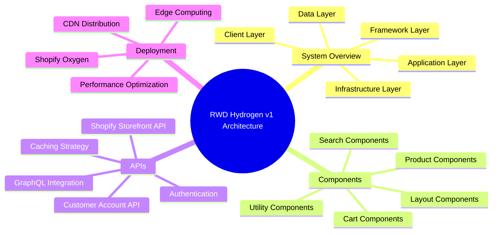

# Architecture Documentation

This directory contains comprehensive technical architecture documentation for the RWD Hydrogen v1 e-commerce application.

## Documentation Overview

### 📋 [Technical Architecture](./TECHNICAL_ARCHITECTURE.md)
Complete system architecture overview with Mermaid diagrams covering:
- System overview and component relationships
- Data flow patterns and request lifecycle
- Routing structure and navigation
- Deployment architecture on Shopify Oxygen
- Technology stack and infrastructure

### 🧩 [Component Architecture](./COMPONENT_ARCHITECTURE.md)
Detailed component structure and design patterns:
- Component hierarchy and relationships
- Responsibilities and data flow
- State management patterns
- Performance optimization strategies
- Accessibility best practices

### 🔌 [API Integration](./API_INTEGRATION.md)
API integration patterns and data management:
- GraphQL schema organization
- Caching strategies and performance
- Authentication and security
- Error handling and recovery
- Type safety and code generation

## Quick Navigation

## Architecture Principles

### 🎯 **Performance First**
- Server-side rendering with edge computing
- Aggressive caching strategies
- Image optimization and lazy loading
- Code splitting and bundle optimization

### 🔧 **Developer Experience**
- Type-safe development with TypeScript
- Hot module reloading in development
- Automated code generation
- Comprehensive linting and formatting

### 🛡️ **Security & Reliability**
- OAuth-based authentication
- Content Security Policy implementation
- Error boundaries and graceful fallbacks
- Comprehensive monitoring and logging

### ♿ **Accessibility**
- Semantic HTML structure
- ARIA labels and screen reader support
- Keyboard navigation
- Color contrast compliance

### 📱 **Mobile-First Design**
- Responsive design patterns
- Progressive Web App capabilities
- Touch-friendly interactions
- Optimized mobile performance

## Technology Stack Summary

### **Frontend Framework**
- **React 18** - Component-based UI with concurrent features
- **Remix** - Full-stack framework with nested routing
- **Vite** - Fast build tool and development server

### **E-commerce Platform**
- **Shopify Hydrogen** - Headless commerce framework
- **Shopify Oxygen** - Edge deployment platform
- **Shopify APIs** - Storefront and Customer Account APIs

### **Development Tools**
- **TypeScript** - Type-safe development
- **GraphQL** - Efficient data fetching
- **ESLint/Prettier** - Code quality and formatting

## Getting Started

1. **Review System Overview**: Start with [Technical Architecture](./TECHNICAL_ARCHITECTURE.md) for high-level understanding
2. **Understand Components**: Read [Component Architecture](./COMPONENT_ARCHITECTURE.md) for UI structure
3. **Learn Data Flow**: Study [API Integration](./API_INTEGRATION.md) for data management patterns

## Architecture Diagrams

The documentation includes comprehensive Mermaid diagrams for:

- **System Architecture**: High-level component relationships
- **Component Hierarchy**: UI component structure and data flow
- **API Integration**: GraphQL schema and data fetching patterns
- **Deployment Flow**: Build and deployment processes
- **Security Model**: Authentication and authorization flows

## Contributing to Documentation

When making architectural changes:

1. Update relevant documentation files
2. Include new Mermaid diagrams for visual representation
3. Update the main README if new concepts are introduced
4. Ensure diagrams are accurate and up-to-date

## Additional Resources

- [Shopify Hydrogen Documentation](https://shopify.dev/custom-storefronts/hydrogen)
- [Remix Documentation](https://remix.run/docs)
- [React Documentation](https://react.dev)
- [Shopify API Documentation](https://shopify.dev/api)

---

*This documentation is maintained as part of the RWD Hydrogen v1 project and should be updated with any architectural changes.*