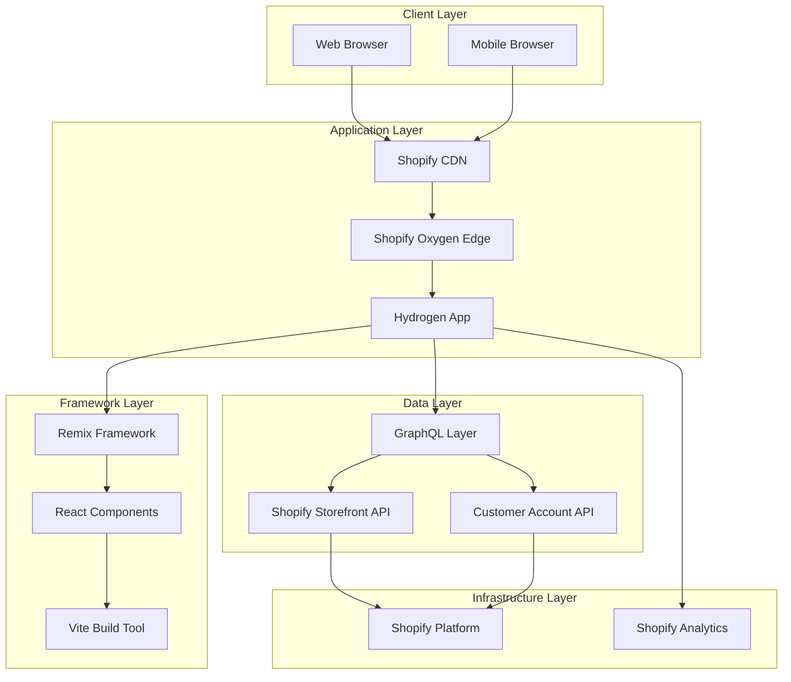
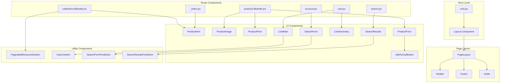
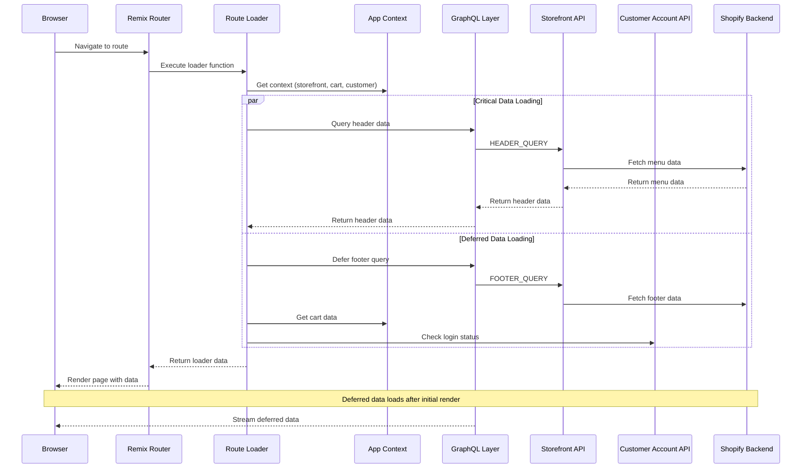
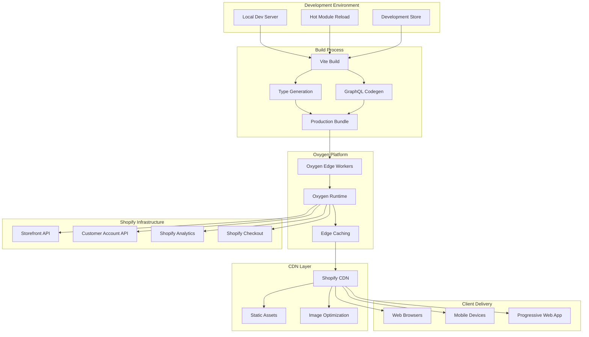
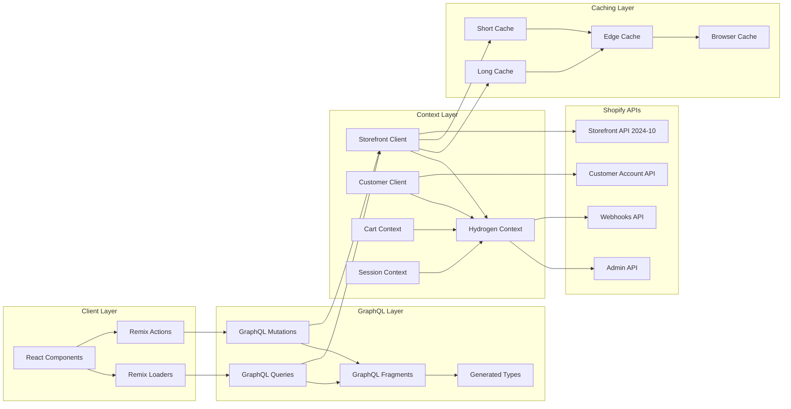

# Technical Architecture Documentation

This document provides comprehensive technical architecture documentation for the RWD Hydrogen v1 e-commerce application.

## Table of Contents

1. [System Overview](#system-overview)
2. [Component Architecture](#component-architecture)
3. [Data Flow Architecture](#data-flow-architecture)
4. [Routing Architecture](#routing-architecture)
5. [Deployment Architecture](#deployment-architecture)
6. [API Integration Architecture](#api-integration-architecture)
7. [Technology Stack](#technology-stack)

## System Overview

The RWD Hydrogen v1 application is built on Shopify's Hydrogen framework, which provides a React-based headless commerce solution. The system follows a modern full-stack architecture with server-side rendering capabilities.



## Component Architecture

The application follows a modular component architecture with clear separation of concerns.



## Data Flow Architecture

The application implements a comprehensive data flow pattern using GraphQL for API communication and Remix loaders for data fetching.



## Routing Architecture

The application uses file-based routing provided by Remix, with a clear hierarchical structure.

```mermaid
graph TD
    subgraph "Root Routes"
        RootRoute[/ - _index.jsx]
        RobotsRoute[/robots.txt - robots.txt.jsx]
        SitemapRoute[/sitemap.xml - sitemap.xml.jsx]
        APIRoute[/api - api.$version.jsx]
    end
    
    subgraph "Product Routes"
        ProductsIndex[/products - products._index.jsx]
        ProductHandle[/products/:handle - products.$handle.jsx]
    end
    
    subgraph "Collection Routes"
        CollectionsIndex[/collections - collections._index.jsx]
        CollectionAll[/collections/all - collections.all.jsx]
        CollectionHandle[/collections/:handle - collections.$handle.jsx]
    end
    
    subgraph "Account Routes"
        AccountIndex[/account - account._index.jsx]
        AccountProfile[/account/profile - account.profile.jsx]
        AccountOrders[/account/orders - account.orders._index.jsx]
        AccountOrderDetail[/account/orders/:id - account.orders.$id.jsx]
        AccountAddresses[/account/addresses - account.addresses.jsx]
        AccountLogin[/account/login - account_.login.jsx]
        AccountLogout[/account/logout - account_.logout.jsx]
        AccountAuthorize[/account/authorize - account_.authorize.jsx]
    end
    
    subgraph "Commerce Routes"
        CartRoute[/cart - cart.jsx]
        CartLines[/cart/:lines - cart.$lines.jsx]
        SearchRoute[/search - search.jsx]
        DiscountRoute[/discount/:code - discount.$code.jsx]
    end
    
    subgraph "Content Routes"
        BlogsIndex[/blogs - blogs._index.jsx]
        BlogHandle[/blogs/:blogHandle - blogs.$blogHandle._index.jsx]
        ArticleHandle[/blogs/:blogHandle/:articleHandle - blogs.$blogHandle.$articleHandle.jsx]
        PagesHandle[/pages/:handle - pages.$handle.jsx]
        PoliciesIndex[/policies - policies._index.jsx]
        PolicyHandle[/policies/:handle - policies.$handle.jsx]
    end
    
    subgraph "Utility Routes"
        CatchAll[/* - $.jsx]
        SitemapDynamic[/sitemap/:type/:page.xml - sitemap.$type.$page.xml.jsx]
    end
    
    RootRoute --> ProductsIndex
    RootRoute --> CollectionsIndex
    RootRoute --> AccountIndex
    RootRoute --> CartRoute
    RootRoute --> SearchRoute
    RootRoute --> BlogsIndex
    RootRoute --> PagesHandle
    RootRoute --> PoliciesIndex
```

## Deployment Architecture

The application is designed to deploy on Shopify's Oxygen platform with edge computing capabilities.



## API Integration Architecture

The application integrates with multiple Shopify APIs through a GraphQL layer with proper caching and optimization.



## Technology Stack

### Frontend Technologies
- **React 18**: Component-based UI framework with concurrent features
- **Remix**: Full-stack web framework with nested routing and data loading
- **React Router 7**: Client-side routing with data loading capabilities
- **TypeScript**: Type-safe JavaScript development
- **Vite**: Fast build tool and dev server

### Backend Technologies
- **Shopify Hydrogen**: React-based framework for headless commerce
- **Shopify Oxygen**: Edge computing platform for deployment
- **GraphQL**: Query language for API communication
- **Node.js**: JavaScript runtime environment

### Development Tools
- **ESLint**: Code linting and quality enforcement
- **Prettier**: Code formatting
- **GraphQL Code Generator**: Automatic type generation from GraphQL schemas
- **Shopify CLI**: Development and deployment tooling

### Infrastructure
- **Shopify Platform**: E-commerce backend and infrastructure
- **Shopify CDN**: Content delivery network
- **Edge Workers**: Serverless compute at the edge
- **Progressive Web App**: Modern web app capabilities

### API Integration
- **Shopify Storefront API**: Product and store data access
- **Customer Account API**: Customer authentication and account management
- **Admin API**: Store administration capabilities
- **Webhooks**: Real-time event notifications

This architecture provides a scalable, performant, and maintainable foundation for modern e-commerce applications with excellent developer experience and optimal user performance.